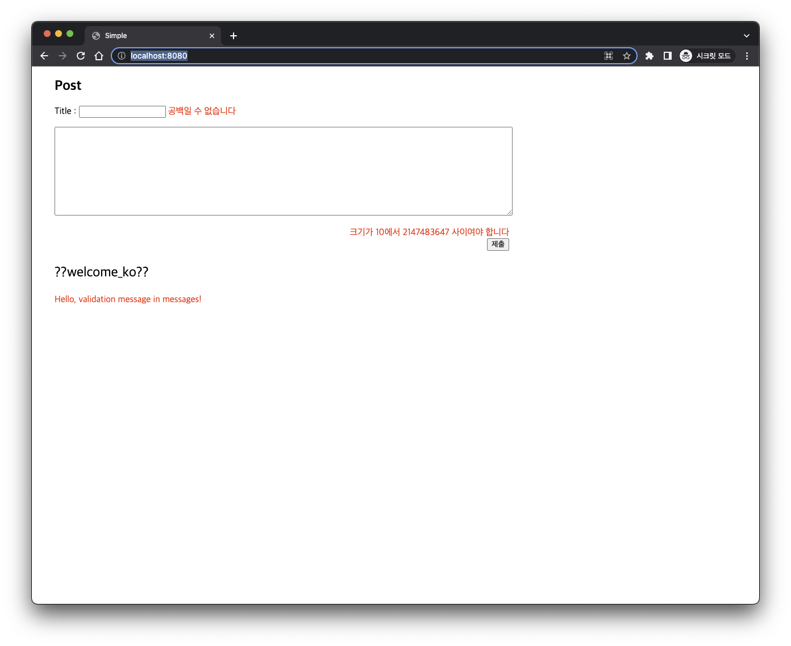

# Test-Validation-Message

## bb9f7f39df39a7c8796022fc1e8279874b5509e9
> 
> 
> Error Message -> by default messages

## bf5edaa67e95c58af8f7ad25720807b5be6e8875
> 
> 
> Error Message -> by default validation messages

## 5b3c3d8969a37560a5a44ce7cf403aa7110e7d39
> 
> 
> Error Message -> by set validation messages, after configuration

## e8b51f630623c4bb8e1769b95dd6103346bdd97f
> 
> 
> Add setting of bean name and qualifier
